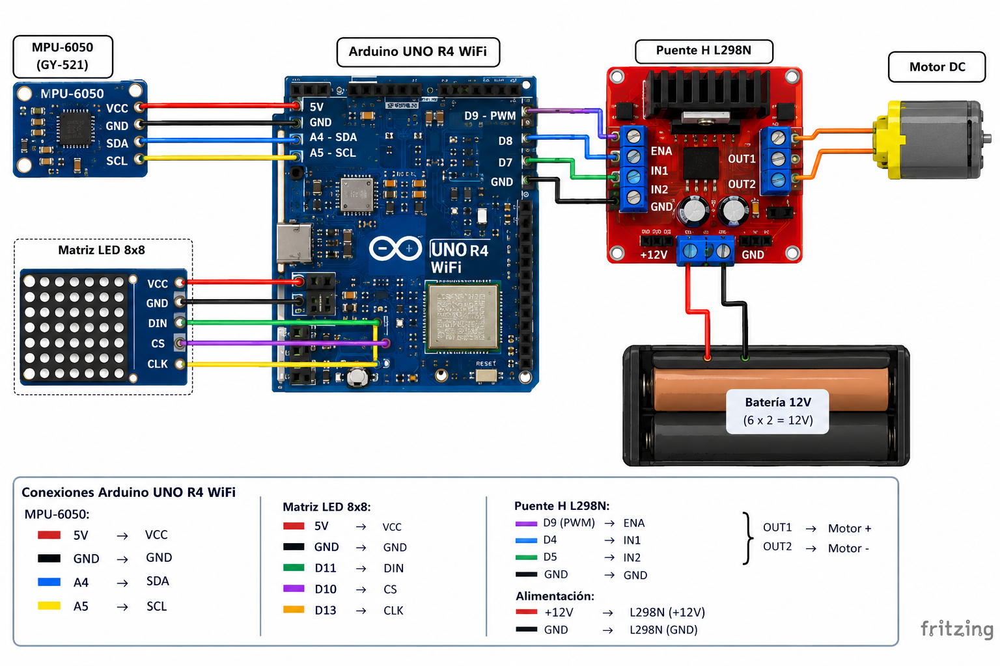

# Inclinómetro con Control de Motorreductor

## Descripción

Esta práctica tiene como propósito implementar un sistema de control de inclinación mediante un Arduino UNO R4 WiFi, un sensor MPU-6050 y un motorreductor accionado a través de un módulo puente H L298N.

El sistema lee el ángulo de inclinación combinando el acelerómetro y el giroscopio del MPU-6050 mediante un filtro complementario, y en función de ese ángulo genera una señal PWM que controla la velocidad y el sentido de giro del motorreductor. El sistema incluye zona muerta, rampa de aceleración y mecanismos de seguridad ante fallas de comunicación con el sensor, además de un indicador visual en la matriz de LED integrada del Arduino.

## Objetivos

* Implementar la lectura de un sensor MPU-6050 por el bus I2C.
* Calcular el ángulo de inclinación mediante un filtro complementario (acelerómetro + giroscopio).
* Controlar la velocidad y el sentido de giro de un motorreductor mediante un puente H L298N.
* Aplicar zona muerta y rampa de aceleración para suavizar la respuesta del motor.
* Implementar una máquina de estados que maneje fallas de comunicación de forma segura.
* Utilizar la matriz de LED del Arduino UNO R4 WiFi como indicador visual del estado del sistema.

## Herramientas y material utilizado

* Arduino UNO R4 WiFi.
* Sensor acelerómetro/giroscopio MPU-6050.
* Módulo puente H L298N.
* Motorreductor (DC con reductor).
* Resistencia de 10 kΩ (entre ENA y GND, para mantener el motor deshabilitado durante el arranque).
* Protoboard y cables de conexión.
* Fuente de alimentación externa para el motor.

## Diagrama

El diagrama muestra las conexiones entre el Arduino UNO R4 WiFi, el sensor MPU-6050 (bus I2C: SDA=A4, SCL=A5, AD0=GND) y el módulo puente H L298N (ENA=D9, IN1=D8, IN2=D7).



## Código

El programa implementa una máquina de estados (BLOQUEADO, ACTIVO, PARO, RECUPERANDO) que calcula el ángulo de inclinación mediante un filtro complementario, calcula el PWM objetivo según el ángulo (con zona muerta y saturación), y lo aplica al motor mediante una rampa de aceleración. También incluye recuperación automática ante fallas del sensor y reporte del estado por el Monitor Serie.

[Ver código](codigo/c_motorreductor.ino)

## Reporte

El reporte contiene la explicación del funcionamiento del sistema, la metodología utilizada, el detalle de las conexiones, el análisis de los resultados y las conclusiones obtenidas durante la práctica.

[Ver Reporte](reporte/Reporte_Inclinometro.pdf)

## Resultados

Durante las pruebas, el sistema respondió de forma proporcional a la inclinación del sensor: con ángulos pequeños (5°) el motor giró hacia adelante con un PWM bajo, mientras que al aumentar la inclinación el PWM creció de forma gradual hasta saturarse en 100% alrededor de los 45°, tanto hacia adelante como en reversa.

Un fragmento representativo del Monitor Serie durante la prueba fue:

```
Inclinacion: adelante | 5 grados | leve | Motor: adelante | PWM: 14 %
Inclinacion: adelante | 12 grados | leve | Motor: adelante | PWM: 47 %
Inclinacion: atras | -45 grados | fuerte | Motor: reversa | PWM: 100 %
Inclinacion: atras | -73 grados | fuerte | Motor: reversa | PWM: 100 %
Inclinacion: adelante | 30 grados | fuerte | Motor: adelante | PWM: 18 %
ENTRA AL CENTRO: sensor dentro de +/-2 grados.
Inclinacion: centrado | 2 grados | leve | Motor: adelante | PWM: 37 %
SALE DEL CENTRO.
Inclinacion: atras | -56 grados | fuerte | Motor: reversa | PWM: 100 %
ENTRA AL CENTRO: sensor dentro de +/-2 grados.
Inclinacion: centrado | 0 grados | leve | Motor: detenido | PWM: 0 %
```

Se observa que el sistema reportó correctamente los eventos de entrada y salida de la zona centrada (±2°), y que el motor se detuvo por completo al regresar al centro. La rampa de aceleración se reflejó en los cambios graduales de PWM entre lecturas consecutivas, en lugar de saltos abruptos de velocidad.

## Video

El video muestra el funcionamiento del inclinómetro, incluyendo la respuesta del motor ante distintos ángulos de inclinación y el comportamiento del sistema al centrarse.

[Ver video](https://youtu.be/SBVAgIKjInA?si=CmYuDTaJlx-kI0Er)

## Conclusiones

El filtro complementario permitió obtener una estimación de ángulo estable, combinando la respuesta rápida del giroscopio con la estabilidad a largo plazo del acelerómetro. La zona muerta evitó que el motor respondiera a pequeñas vibraciones, mientras que la rampa de aceleración suavizó los cambios de velocidad y dirección, como se observó en los valores graduales de PWM durante las pruebas.

La máquina de estados permitió manejar de forma segura el sistema ante posibles fallas de comunicación con el sensor, y el uso de `millis()` y `micros()` permitió que la lectura del sensor, el control del motor, el reporte por Monitor Serie y la actualización de la matriz de LED funcionaran de manera simultánea sin bloquear el programa.

En conjunto, la práctica permitió relacionar la fusión de sensores con el control proporcional de un actuador físico, comprobando su funcionamiento mediante las pruebas realizadas y el análisis de la salida del Monitor Serie.
